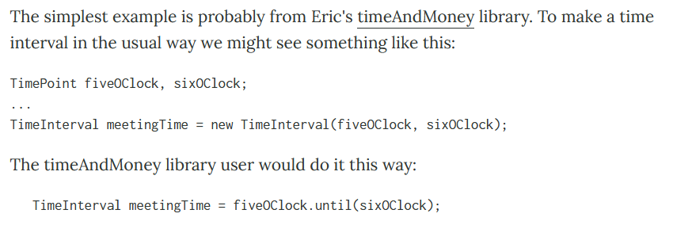

# Selenium Guidelines Practice

*A simple Selenium example **applying 3 officially recommended design suggestions** proposed by the Guidelines(https://www.selenium.dev/documentation/en/guidelines_and_recommendations/), using Python language and tested on Google homepage(www.google.com).*

Here are 2 main motivations for this project:

1. On official Guidelines page, only Java-version code is provided. It might helps if a Python-version code could be shared.
2. Official code is abstract and has been broken into pieces, it might helps if a complete and out-of-box code could be shared.

In this README, some personal understanding will be proposed briefly,  reading that part can be risky because the points may be misleading and even wrong(after all it's just personal :D), so skip if you disagree. The code with annotations will be displayed in `example.py`. Still, no need to take it very seriously, if there's anything wrong, please point it out or just make it right to yourself.

## Page object models

Define a  `XxxPage` class for each webpage that will be used in your test but do no testing in these classes, instead, do testing from the outside. 

In details:

1. Construct a `By` object for each element in the page and add it to `Page` class as attributes.
2. Check if the webpage has loaded correctly using `assert` on some conditions within the constructor. And this is going to be the only test part in the whole `Page` class.
3. Define behaviors on the webpage and implement them by calling WebDriver's attributes. Note: `return` to the target `Page` object when the behavior really leads you to a new webpage.

## Fluent API

By fluent it means the methods can be called in a chain which describes an ordered set of behaviors in a readable and continuous way.  Here is a really distinct example from *Martin Fowler* (https://www.martinfowler.com/bliki/FluentInterface.html): 

In order to do this, some methods have to be adjusted to return specific objects. There might be no general rules about how to do the adjustment though, these advice below may help a little:

1. `return self` if the method originally returns nothing or None.
2. Keep it still if the method originally returns another `Page` object.
3. Return whatever that meets the need if there's no more behaviors need to be done on top of it, like a `get_content()` method that returns some information.

Also, sometimes breaking an method into more methods that implements atomic functions  can be helpful.

## Domain specific language

Applying domain specific language is more like a process rewriting coder's language into easy-to-understand language for target users. In `Page` methods, definition of the functions describes the behavior in <u>webpage's view</u>. Now try to pack these methods with more top-level interfaces in <u>user's view</u>. A user knows nothing about WebDriver or relations between `Page`s, he only operates the browser and `assert`s if anything goes beyond expectations. 